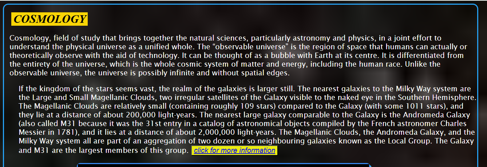
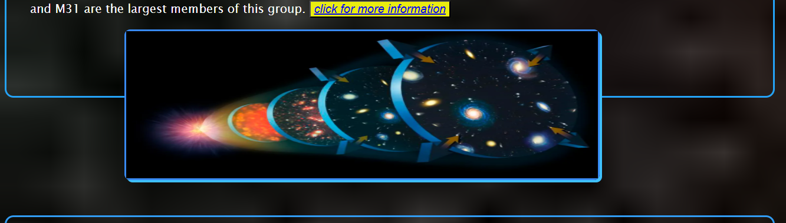
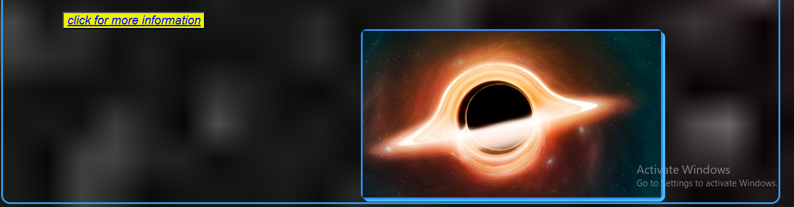

# Presentation Page

This is a simple one-page presentation website built using HTML and CSS.  
It was created as a part of my frontend course to practice layout and design.

## 🔗 Live Site
[Click here to view it](https://saweraasad.github.io/Presentation-page/)

## 🚀 Features
- One-page layout
- Basic HTML5 structure
- Clean CSS design

## 📂 Files
- `index.html`: Main HTML file
- `images/`: Folder containing used images

## 🎯 Purpose
To practice structuring and styling a basic HTML/CSS project for web presentation.

## 📸 Screenshot (Optional)

